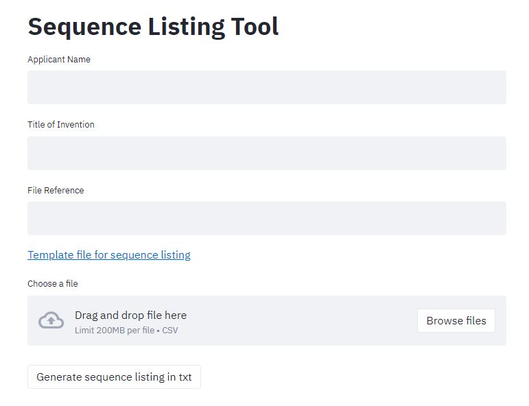
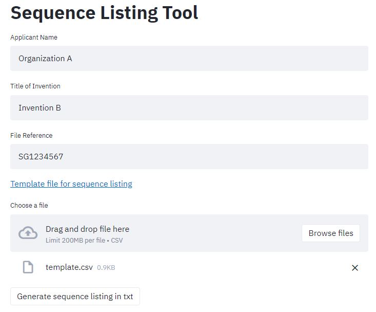
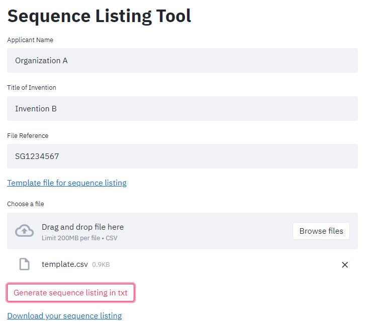

# Tools for generating sequence listing for patent application

## Introduction

This tool is designed to generate a sequence listing in the format prescribed by WIPO. The user can use the template csv file to define multiple sequences for the app to generate the sequence listing. This allow rapid generation of sequence listing, as opposed to some other tools, where user have to enter the sequence one by one. This allow the use to save a lot of time in the preparation of sequence listing for patent application.

## Installation

0. If you do not have git, please following the instruction [here][1] to install git. And refer to [this page][2] to install python 3.7 if you do not have it.
1. Use git to clone this repository
```
git clone https://github.com/simonchuth/seq_listing_patent_tool.git
```
2. Use pip to install the required dependencies
```
pip install --upgrade -r requirements.txt
```
3. Use the following command to run the streamlit app
```
streamlit run src/app.py
```

### Running on AWS EC2 instance
Use the `iptables` to redirect the traffic from port 80 to port 8501 (before running the streamlit app)
```
iptables -t nat -A PREROUTING -i eth0 -p tcp --dport 80 -j REDIRECT --to-port 8501
```

## User Guide
**Landing Page** <br>

1. Enter the mandatory information such as `Applicant Name`, `Title of Invention`, and `File Reference`
2. Click on `Template file for sequence listing` to download the latest template file (Must use this csv file to upload the sequence, do NOT add/delete/change the columns in the csv file)
3. Drag and drop the csv file to `Choose a file`

**Example of page furnished with details** <br>


4. Click `Generate sequence listing in txt`



5. Click `Download your sequence listing` to download the sequence listing

<!-- Reference links -->
[1]: https://git-scm.com/downloads
[2]: https://www.python.org/downloads/